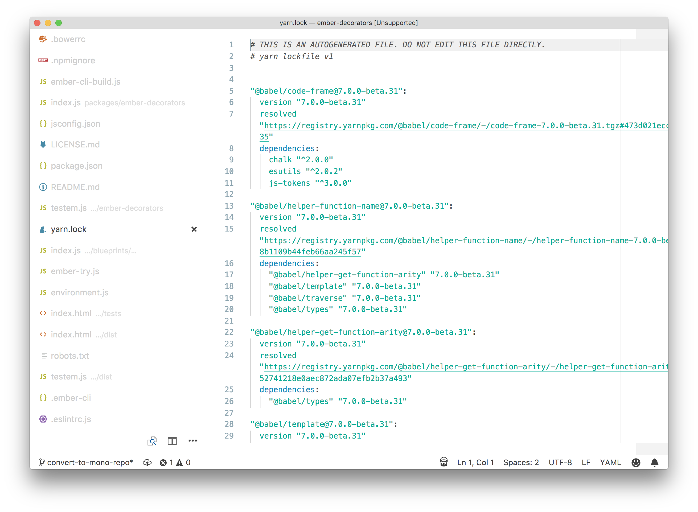

# Vertical Tab Bar

This extension adds styles to turn the tab bar into a vertical tab bar. This is
only done when the standard sidebar is hidden, so it doesn't consume to much
space. This makes it much easier to deal with large lists of files:



## Installation

Install and activate [VS Code Custom CSS Plugin](https://github.com/be5invis/vscode-custom-css)

Add the following to your user settings. Make sure you substitute your home folder for the custom CSS path below.

```
{
    "vscode_custom_css.imports": [
        "file:///Users/PATH_TO_YOUR_HOME_FOLDER/.vscode/extensions/pzuraq.vertical-tab-bar-1.0.0/styles.css"
    ]
}
```
